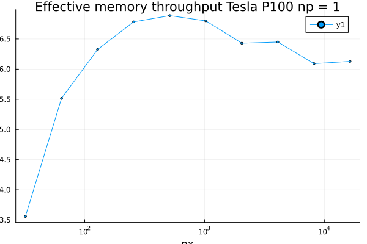

# Porous Convection

## Introduction
Modelling of multi-physical processes poses challanges which can be addressed using HPC. This couse introduces the psudo-transient method to targets clusters featuring nodes with multiple GPUs which reward fine-grained parallisation of homogeneous tasks.

The aim of this procet is to to extend a previously implemented pseudo-transient porous convection solver in two dimensions written for the use on a single CPU architecture, to three dimensions and shared memory applications. This is achieved through several intermediate steps; 1) enhancing the code for the use on CPU/GPU alike making use of the ParallelStencil.jl and CUDA.jl package, 2) extending the XPU version of the code to 3D, 3) enabling the code to be used on multi-XPU architectures using MPI.jl and ImplizitGlobalGrid.jl. 

## Physics
The underlying equations are:
 - Darcy flux
```math
\boldsymbol{q}_D =-\frac{k}{\eta}\left(\nabla p-\rho_0 \alpha \boldsymbol{g} T\right)
```
- Mass balance equation
```math
\nabla \cdot \boldsymbol{q}_{\boldsymbol{D}}=0
```
- Temperature diffusion flux
```math
\boldsymbol{q}_{\boldsymbol{T}}+\frac{\lambda}{\rho_0 c_p} \nabla T=0
```
- Transient advection-diffusion equation
```math
\frac{\partial T}{\partial t}+\frac{1}{\varphi} \boldsymbol{q}_{\boldsymbol{D}} \cdot \nabla T+\nabla \cdot \boldsymbol{q}_{\boldsymbol{T}}=0
```

where $q_{D}$ is the Darcy flux, $k$ is the permeability, $\eta$ id the fluid viscosity, $p$ is the pressure, $\rho_{0}$ is the density, $\alpha$ is the termal expansion coeficient, $T$ is the temperature, $q_{T}$ is the conductive heat flux, $c_{p}$ is the specific heat capacity, $t$ it the physical time and $\varphi$ is the porosity.

## Numerical methods
The
$$
\begin{alignat}{1}
&\theta_D \frac{\partial \boldsymbol{q}_D}{\partial \tau}+\boldsymbol{q}_D=-\frac{k}{\eta}\left(\nabla p-\rho_0 \alpha \boldsymbol{g} T\right) \\
&\theta_T \frac{\partial \boldsymbol{q}_T}{\partial \tau}+\boldsymbol{q}_T=-\frac{\lambda}{\rho_0 c_p} \nabla T = R_{P_{f}}\\
&\beta \frac{\partial p}{\partial \tau}+\nabla \cdot \boldsymbol{q}_D=0=R_{T} \\
&\frac{\partial T}{\partial \tau}+\frac{T-T_{\text {old }}}{\mathrm{d} t}+\frac{1}{\varphi} \boldsymbol{q}_D \cdot \nabla T+\nabla \cdot \boldsymbol{q}_{\boldsymbol{T}}=0
\end{alignat}
$$


## Results

[](https://github.com/TheFibonacciEffect/pde-on-gpu-gutsche/actions/workflows/CI.yml)

[](https://github.com/TheFibonacciEffect/pde-on-gpu-gutsche/actions/workflows/Literate.yml)

<!-- [](https://github.com/omlins/ParallelStencil.jl/actions) -->

### Weak scaling


The was scaled across multiple GPUs with the same total number of timesteps to ensure that the code does not take significantly longer for the halo exchange with multiple GPUs.

### Strong Scaling

The problem size was scaled to find the optimal problem size for a single GPU. As we can see the effective memory throughput is largest for a problem size of 512 x 512.

### Porous convection 2D
This is the temperature distribution and flux when running the porous convection 2D code on a 511 1023 with 4000 timesteps


### Porous convection 3D
this is the same phenomenon in 3D. Here is the temperature distribution during the 2000 timesteps with `nx,ny,nz = 506-250-250`.

## Discussion/Conclusion
