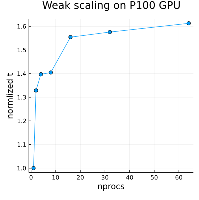

# Porous Convection

## Introduction
Modelling of multi-physical processes poses challenges which can be addressed using HPC. This course introduces the psudo-transient method to targets clusters featuring nodes with multiple GPUs which reward fine-grained parallisation of homogeneous tasks.

The aim of this project is to extend a previously implemented pseudo-transient porous convection solver in two dimensions written for the use on a single CPU architecture, to three dimensions and shared memory applications. This is achieved through several intermediate steps; 1) enhancing the code for the use on CPU/GPU alike making use of the ParallelStencil.jl and CUDA.jl package, 2) extending the XPU version of the code to 3D, 3) enabling the code to be used on multi-XPU architectures using MPI.jl and ImplizitGlobalGrid.jl. 

## Physics
The underlying equations are:
 - Darcy flux
```math
\begin{alignat}{1}
    \boldsymbol{q}_D =-\frac{k}{\eta}\left(\nabla p-\rho_0 \alpha \boldsymbol{g} T\right)
\end{alignat}
```
- Mass balance equation
```math
\begin{alignat}{1}
    \nabla \cdot \boldsymbol{q}_{\boldsymbol{D}}=0
\end{alignat}
```
- Temperature diffusion flux
```math
\begin{alignat}{1}
    \boldsymbol{q}_{\boldsymbol{T}}+\frac{\lambda}{\rho_0 c_p} \nabla T=0
\end{alignat}
```
- Transient advection-diffusion equation
```math
\begin{alignat}{1}
    \frac{\partial T}{\partial t}+\frac{1}{\varphi} \boldsymbol{q}_{\boldsymbol{D}} \cdot \nabla T+\nabla \cdot \boldsymbol{q}_{\boldsymbol{T}}=0
\end{alignat}
```

where $q_{D}$ is the Darcy flux, $k$ is the permeability, $\eta$ id the fluid viscosity, $p$ is the pressure, $\rho_{0}$ is the density, $\alpha$ is the thermal expansion coefficient, $T$ is the temperature, $q_{T}$ is the conductive heat flux, $c_{p}$ is the specific heat capacity, $t$ it the physical time and $\varphi$ is the porosity.

## Numerical methods
To solve this coupled system of equations for steady state at each time step, the pseudo-transient method is applied, where the time evolution is achieved by discretising the time derivative in eq(4). This means that eq(1-4) are augmented with pseudo-transient derivatives, in the case of eq(1-2) adding inertial terms to the system, in eq(3) a pseudo compressibility and in eq(4) the physical time step is discretised using first order Euler integration and a pseudo-transient term is added to solve to steady state equation at each time step.
The left-hand sides of the mass balance and temperature flux equations are measured as residuals, which are used to control the divergence behaviour of the iterative method.
```math
\begin{alignat}{1}
    &\theta_D \frac{\partial \boldsymbol{q}_D}{\partial \tau}+\boldsymbol{q}_D=-\frac{k}{\eta}\left(\nabla p-\rho_0 \alpha \boldsymbol{g} T\right) \\
    &\theta_T \frac{\partial \boldsymbol{q}_T}{\partial \tau}+\boldsymbol{q}_T+\frac{\lambda}{\rho_0 c_p} \nabla T =0= R_{P_{f}}\\
    &\beta \frac{\partial p}{\partial \tau}+\nabla \cdot \boldsymbol{q}_D=0=R_{T} \\
    &\frac{\partial T}{\partial \tau}+\frac{T-T_{\text {old }}}{\mathrm{d} t}+\frac{1}{\varphi} \boldsymbol{q}_D \cdot \nabla T+\nabla \cdot \boldsymbol{q}_{\boldsymbol{T}}=0
\end{alignat}
```

where $\theta_{D}$ is the characteristic relaxation time for pressure, $\theta_{T}$ is the characteristic relaxation time for temperature, $\beta$ is the pseudo compresibility and $\tau$ is the pseudo-time.


## Results

[](https://github.com/TheFibonacciEffect/pde-on-gpu-gutsche/actions/workflows/CI.yml)

[](https://github.com/TheFibonacciEffect/pde-on-gpu-gutsche/actions/workflows/Literate.yml)

<!-- [](https://github.com/omlins/ParallelStencil.jl/actions) -->

### Weak scaling


Unreasonable result of weak scaling using p processes for a p-fold problem normalised by the time for one process. We would expect the times for p processes to be smaller than the time for one process because of communication overhead.

### Strong Scaling

The problem size was scaled to find the optimal problem size for a single GPU. As we can see the effective memory throughput is largest for a problem size of 512 x 512.

### Porous convection 2D
This is the temperature distribution and flux when running the porous convection 2D code on a 511 1023 with 4000 timesteps


### Porous convection 3D
this is the same phenomenon in 3D. Here is the temperature distribution during the 2000 timesteps with `nx,ny,nz = 506-250-250`.


## Discussion/Conclusion

Unfortunately, we cannot say much about the performance section since we did not manage to produce reasonable output. The cause for this might be our determination to automatise sending scripts to Daint as much as possible, running into multiple errors.

Nevertheless, we managed to get reasonable results for the 3D porous convection simulation. From this we can say that using ParallelStencil.jl combinded with ImplizitGlobalGrid.jl reduces effort to write fast code running on CPU and GPU architecture alike as well as deploying them on shared memory systems.

Next steps would be to redo the the performance analysis again to get some consistant results. 
