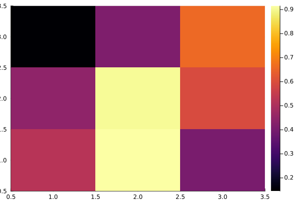

Saves array A as binary file with name Aname.

````julia
function save_array(Aname,A)
    fname = string(Aname,".bin")
    out = open(fname,"w"); write(out,A); close(out)
end;
````

load_array(Aname,A)
Loads bin files with name Aname

````julia
function load_array(Aname,A)
    fname = string(Aname,".bin")
    fid=open(fname,"r"); read!(fid,A); close(fid)
end;
````

main function

````julia
function main()
    # parameter
    n = 3
    A = rand(Float64,n,n)
    B = zeros(Float64,n,n)

    # save array A
    save_array("LitTest",A)

    # load array A into B
    load_array("LitTest",B)

    return B
end;

B = main()
heatmap(B);

savefig("LitTest.png");
````

This generates a heatmap


