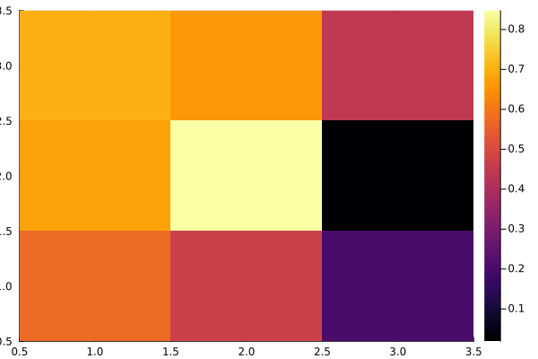

Saves array A as binary file with name Aname.

````julia
function save_array(Aname,A)
    fname = string(Aname,".bin")
    out = open(fname,"w"); write(out,A); close(out)
end;
````

load_array(Aname,A)
Loads bin files with name Aname

````julia
function load_array(Aname,A)
    fname = string(Aname,".bin")
    fid=open(fname,"r"); read!(fid,A); close(fid)
end;
````

main function

````julia
function main()
    # parameter
    n = 3
    A = rand(Float64,n,n)
    B = zeros(Float64,n,n)

    # save array A
    save_array("LitTest",A)

    # load array A into B
    load_array("LitTest",B)

    return B
end;

B = main()
heatmap(B);

savefig("LitTest.png");
````

````
qt.qpa.xcb: could not connect to display 
qt.qpa.plugin: Could not load the Qt platform plugin "xcb" in "" even though it was found.
This application failed to start because no Qt platform plugin could be initialized. Reinstalling the application may fix this problem.

Available platform plugins are: minimal, xcb, minimalegl, offscreen, linuxfb, vnc, eglfs.

Aborted (core dumped)
connect: Connection refused
GKS: can't connect to GKS socket application

GKS: Open failed in routine OPEN_WS
GKS: GKS not in proper state. GKS must be either in the state WSOP or WSAC in routine ACTIVATE_WS

````

This generates a heatmap


