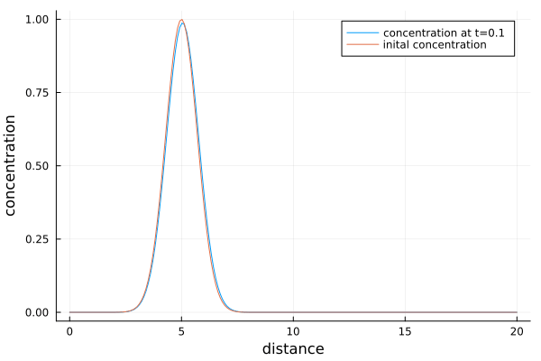
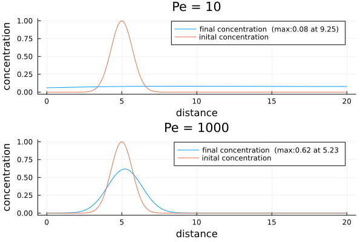
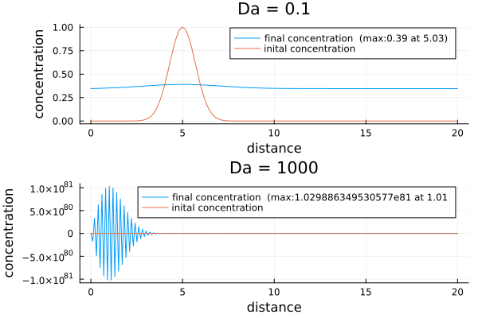
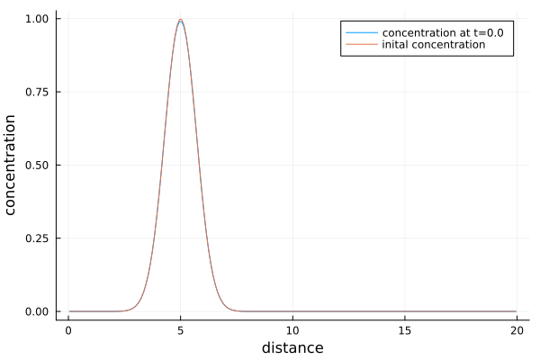
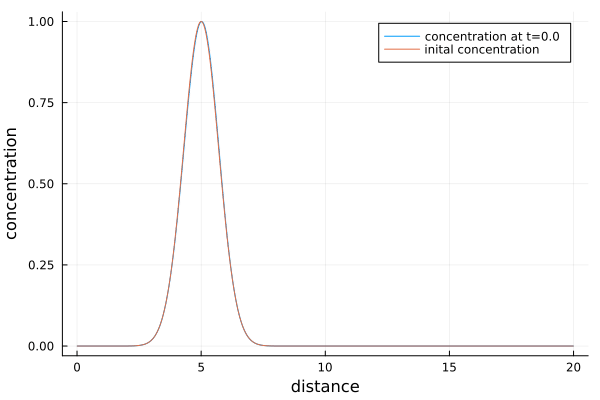

# Week 2

## Plots
### Advenction Diffusion

#### Question 1
The plot with the inital and final concenttation is generated when running the script.
#### Question 2
We can see that the fluid is fully diffused for small $Pe$ while for large $Pe$ is is not. This matches with the intended behaviour.

### Reaction Diffusion
$$ \frac{∂C}{∂t} = -\frac{(C-C_\mathrm{eq})}{ξ}$$

#### Question 1
The plot with the inital and final concenttation is generated when running the script
#### Question 2
Unfortunatly my code becomes unstable when running with a $Da > 1000$. I was unable to determine the reason for this.

## Nonlinear Problems
### Task 1

### Task 2

# Ex 4
See https://github.com/TheFibonacciEffect/pde-on-gpu-gutsche