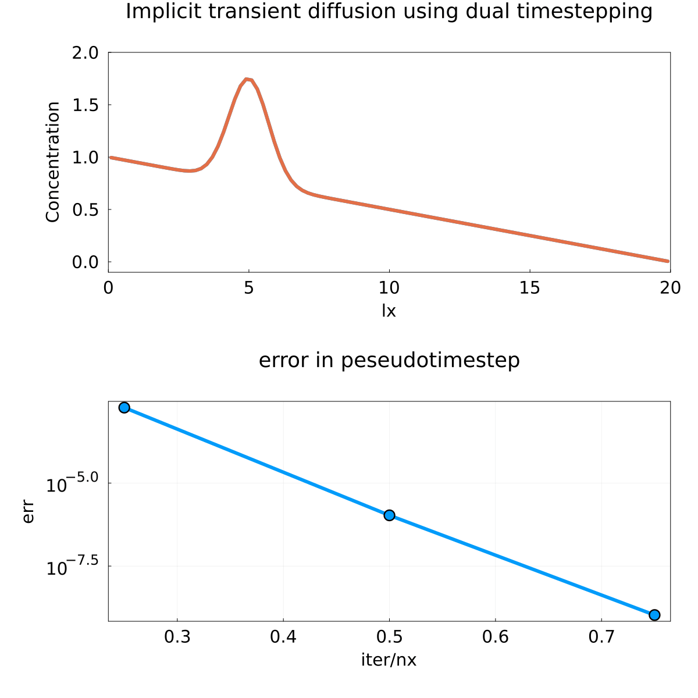
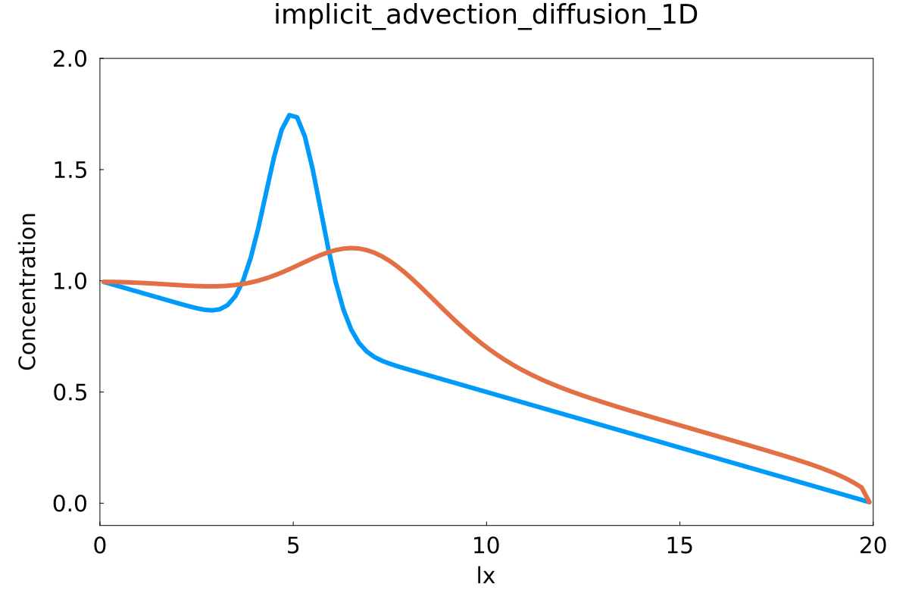
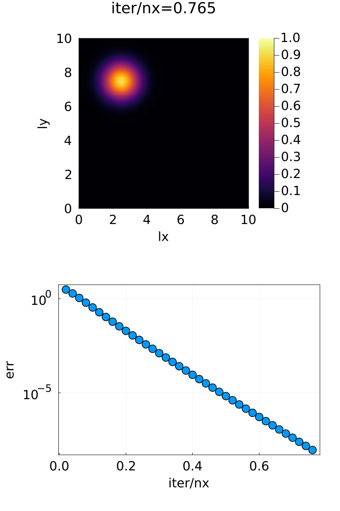
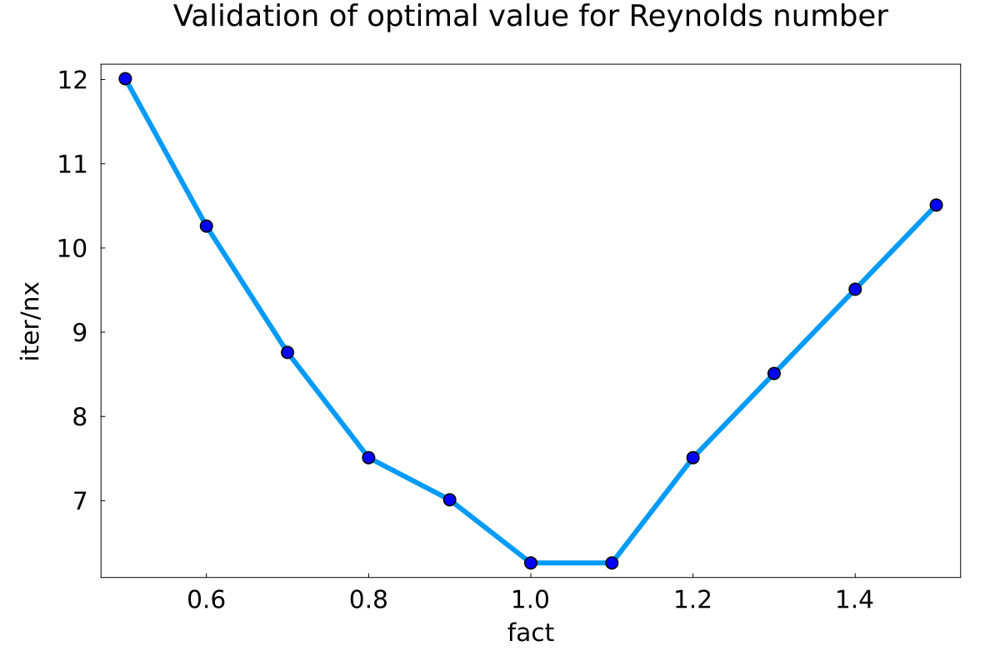

# Week 3
Authors: Caspar Gutsche, Sidney Beeler
## Ex 1

Gif showing 10 timesteps of implicit transient diffusion algorythm. Bottom figure shows the sup of the residual.
## Ex 2

Final state of advection diffusion after 10 timesteps

## Ex3

### Task 1
Only diffusion

### Task 2
Advection diffusion

The code work fine as long as the concentration spike does not approach the boundaries. We have taken velocities as such: vx =10, vy=-10.

## Ex4

