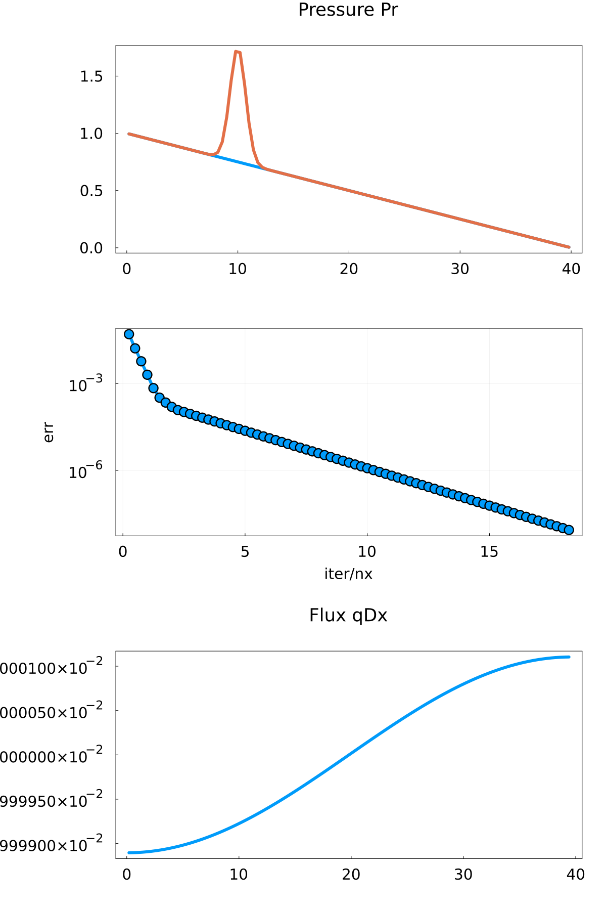

# Exercise 1

## Task 1
The one dimensional convection equation looks like this

## Task 5
The final result for task 5

# Exercise 2
## Task 2

Interestingly it seems that in 500 timesteps more time passed in the explicit than in the implicit approach. But I thought that implicit approaches would allow for a larger timestep?