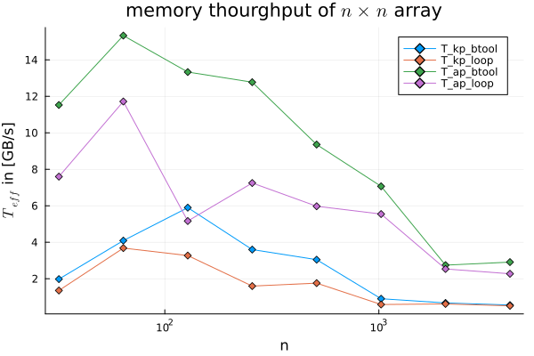

# Lecture 5
## Exercise 2 task 2


I have measured the peak memory bandwith of my [Intel® Core™ i5-10210U Processor](https://ark.intel.com/content/www/us/en/ark/products/195436/intel-core-i510210u-processor-6m-cache-up-to-4-20-ghz.html) by copying an $n \times n$ array for different $n$. The max memory bandwidth by the vendor is 45.8 GB/s. The peak memory throughput found using the benchmark tools is 15.33 GB/s for array programming and 5.89 GB/s using kernel programming. The array programming approach seems to be better suited for most array sizes.

## Exersice 2 task 3

The effective memory throughput was measured for the different programming approaches. The loop programming approach seems to indeed have the best memory throughput, near the throughput reached using array programming. Interrestingly the throughput seems to rise with array size and not decline as was the case for `memcopy`. The performance reached is unfortunatly still far below the performance supplied by the vendor.

## Exercise 3
The tests are

```
test_dict = Dict(
    64	=> [0.00785398056115133 0.007853980637555755 0.007853978592411982],
    128	=> [0.00787296974549236 0.007849556884184108 0.007847181374079883],
    256	=> [0.00740912103848251 0.009143711648167267 0.007419533048751209],
    512	=> [0.00566813765849919 0.004348785338575644 0.005618691590498087])

lx,ly   = 20.0,20.0
for ny = 16 * 2 .^ (2:5)
    @show nx = ny
    dx,dy   = lx/nx,ly/ny
    maxiter = 500
    @show xtest = [5, Int(cld(0.6*lx, dx)), nx-10]
    @show ytest = Int(cld(0.5*ly, dy))
    Pf = Pf_diffusion_2D_loop_fun_parralel(nx,ny;do_check=false)
    @test Pf[xtest,ytest] ≈ test_dict[nx]' atol=1e-3
end

```

the test summary looks like this:
```
Test Summary: | Pass  Total
Pf diffusion  |    4      4
```