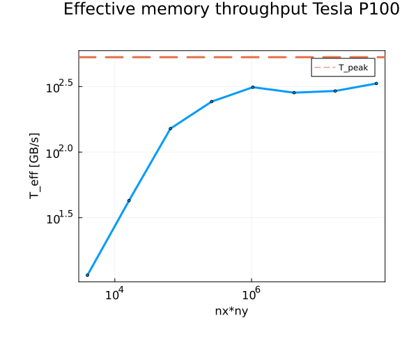

# Lecture 6
Authors: Caspar Gutsche, Sidney Beeler

## Exercise 1
Please have a look at the notebook.
We get $95\%$ the value of T_peak. 
## Exercise 2

### Task 2
Testset doesn't work unfortunatly : (

### Task 4

We have a reasonably high memory throughput. For the diffusion code we have more array read/writes, so the itteration time needed to archieve the same effective memory throughput as the Triad for T_peak is far higher.

## Exercise 3
Please run the test function