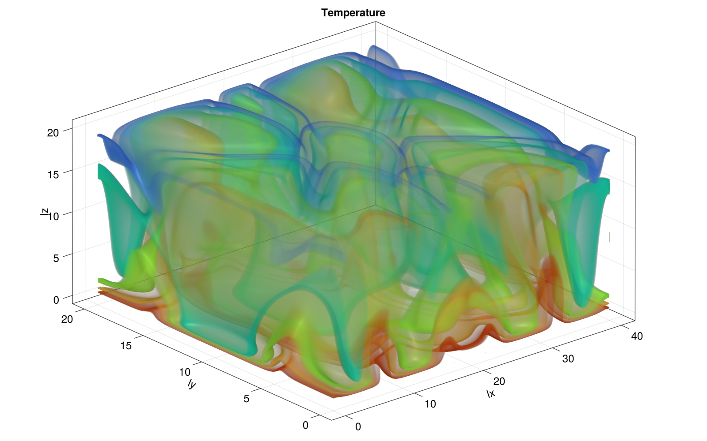

# Lecture 7

## Diffusion 2D code
Computes the 2D diffusion using an xpu implementation. Here is the output:

## Diffusion 3D code
Same thing in 3D

## Porous convection 2D code
Computes the porous convection in 2D using an xpu implementation. Here is the resulting temperature field ans flux.

## Porous convection 3D code
Computes the porous convection in 3D using an xpu implementation. 
Here is the cross section:

We unfortunatly only ran the 3D code with the testing paramerters (and not the final parameters). But now we corrected the mistake, here is the final output after 2000 timsteps (instead of only 100 we used for testing).

