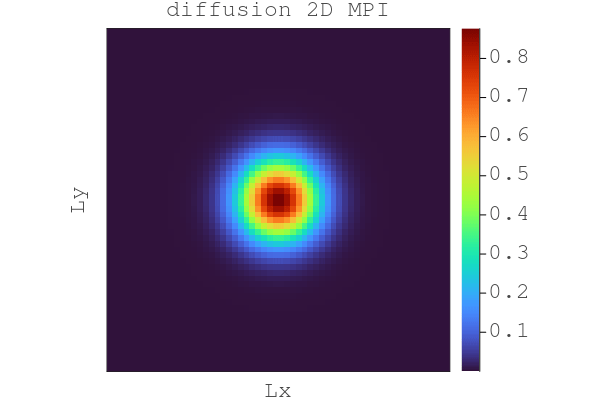

# Lecture 8

## Exercise1

### Task 1

#### 2 Processes
Final output for fake parallelisation in 1D with two processes at $it = 200$

#### n Processes
Final output for fake parallelisation in 1D with n processes at $it = 200$

### Task 2
2D diffusion of quantity C run on 4 procs using mpi on CPU evolving over it=100. 

>***COMMAND:***  mpiexecjl -n 4 julia --project=.. l8_diffusion_2D_mpi.jl

From the src directory

## Task 3
2D diffusion of quantity C run on 4 procs using mpi on GPU evolving over it=100. 

> From 2D to 3D
> 1. Add CUDA.jl
> 2. Use CUDA.Arrays
> 3. To send/recieve data from GPU memory to send buffer use copyto!() function in updatehalo!()
> 4. Create section where GPU_ID is selected

>***COMMAND:***  mpiexecjl -n 4 julia --project=.. l8_diffusion_2D_mpi_gpu.jl

NOTE: When you get an error that says
` Module XY with build ID 12345 is missing from the cache.` it is because every worker [tries to precomile the packege on it's own](https://stackoverflow.com/questions/55410326/module-does-not-support-precompilation-but-is-imported-by-a-module-that-does). Fix it by prcomiling beforehand using `]` precompile.

## Exercise 2

### Task 1

Nothing to report!

### Task 2

### Task 3
We have set the time to 1 in order to save compitation ressources
The test/runtest file tests if the output of task 2 and task 3 are equilvalent

## Task 5
Weak scaling
