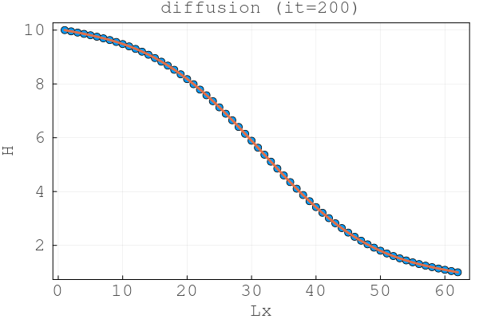
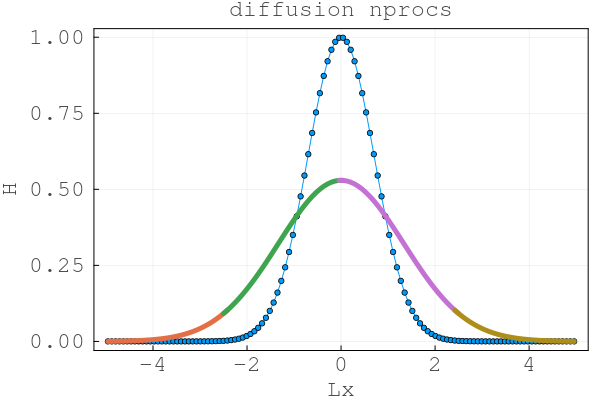

# Lecture 8

## Exercise1

### Task 1

#### 2 Processes
Final output for fake parallelisation with two processes at $it = 200$

#### n Processes
Final output for fake parallelisation with n processes at $it = 200$

### Task 2

>***COMMAND:***  mpiexecjl -n 4 julia --project=.. l8_diffusion_2D_mpi.jl

From the src directory

## Task 3

> From 2D to 3D
> 1. Add CUDA.jl
> 2. Use CUDA.Arrays
> 3. To send/recieve data from GPU memory to send buffer use copyto!() function in updatehalo!()
> 4. Create section where GPU_ID is selected
